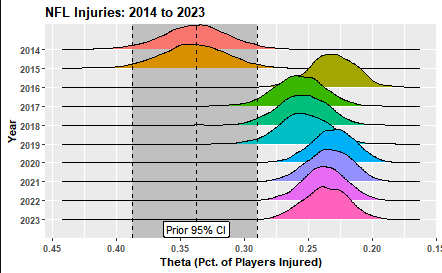

# A Bayesian Analysis on NFL Injuries
Author: Brandon Owens   
Date: 4/10/2024

## Background
The NFL is valued as a $163B organization where athletes compete for a total of 21-24 games during the season (3 preseason, 17 in-season, 1-4 post-season games). A major complaint of fans over the last couple of years has surrounded the significance of injuries on the sport in several ways:

* Athlete Well-Being:
  * The physical and mental health of human beings is important.
  * Injuries impact an athlete's ability to live during and after their careers.
  * New research is demonstrating the tragic significance of once unforseen traumas, like concussions.
  
* Organizational Cost:
  * When star players that fandoms are build around are injured, this devaules the product that the NFL sells.
  * Organizations want players to be hurt to maintain fan interest and to not shell out "guaranteed" money for player contracts when those players aren't participating.
  
With that being said, the NFL has instated over 50 rule changes to reduce player danger since 2002 alone.

## What Are We Looking At?
Have these significant rule changes that have caused controversy really impacted the athlete's for the better? Many fans believe that the league is taking the fun out of the game by limiting exciting plays through hits, collissions, and game-officiating. Thus, are the rule changes actually helping to reduce injuries amongst athletes? That's what we are interested in.

Drawing on information from 2009-2013, we use this prior knowledge to inform a binomial likelihood of the number of players that get hurt in a season compared to all players in the National Football League. This allows us to form beta posterior distributions of what we can confidently predict the percentage of players we'd have expected to have gotten hurt from the 2014-2023 seasons. We are interested in analyzing **if protocols set by the NFL to reduce player injury are successful or not over the last 10 years**.

## Findings

The most massive of the posterior distribution shift comes in 2016, where previously the distributions greatly reflected the prior. With this large shift, it is hard to tell if one rule specifically caused the change, both rules together did, or with the new rules, there was a crackdown on officiating. 

Some of the major rule changes that may explain the posteriors are as follows (from [NFL.com](https://www.nfl.com/playerhealthandsafety/equipment-and-innovation/rules-changes/nfl-health-and-safety-related-rules-changes-since-2002)):

* **2014:** 
  * Clipping and unnecessary roughness penalties expanded to prohibit blockers from rolling up the side of a defender's leg.
* **2015:**
  * "Peel back" blocks extended to offensive players.
  * Backs prohibited from chopping defensive players outside of tackle box.
  * No pushing teammates during kicking attempts.
  * Defenseless player protection expanded to receiver of a pass.
* **2016:**
  * Chop blocks prohibited.
  * Horse collar rule expanded.
  * Move touchback reception to 25 yard line.
* **2017:**
  * Prohibits "leaper" blocks on kicks.
  * Receivers running routes get defenseless player protections.
  * Prohibits crack-back blocks for players in motion.
* **2018:**
  *Lowering the head is officially a penalty to make a tackle.
* **2019:**
  * Expanded protection to defenseless players when initiating a block.
* **2020:**
  * Defenseless player protection expanded to returners.
  * Initial line blocking with the helmet removed.
* **2023:**
  * Fair catch goes to team's 25 yard line hoping for more instances of fair catches.
  * Expands Impermissible Use of the helmet calls.

Regardless, the previous four seasons have completely remained outside of our Prior distributions 95% confidence interval, signifying changes for the better when it comes to new rules and officiating! Next season will see updates to the entire format of the kickoff play and the swivel hip-drop tackle -- two instances of the game highly scrutinized for being dangerous... but also causing controversy with how difficult it will now be to tackle quarterbacks and larger players from behind.

## Run It For Yourself!
1. Install Necessary Packages (found in the top of the [Notebook](https://github.com/brandonowens24/NFL-Injuries-Bayesian-Analysis/blob/main/NFL_injuries_bayesian_analysis.Rmd)
2. Execute that Notebook!

## Files and Folders
* [images](https://github.com/brandonowens24/NFL-Injuries-Bayesian-Analysis/tree/main/images) Contains relevant images for readme and notebook explanations.
* [Notebook](https://github.com/brandonowens24/NFL-Injuries-Bayesian-Analysis/blob/main/NFL_injuries_bayesian_analysis.Rmd) Contains full analysis and breakdown of the problem with executable code!
* [Notebook html](https://github.com/brandonowens24/NFL-Injuries-Bayesian-Analysis/blob/main/NFL_injury_bayesian_analysis.html) Contains raw html file.

