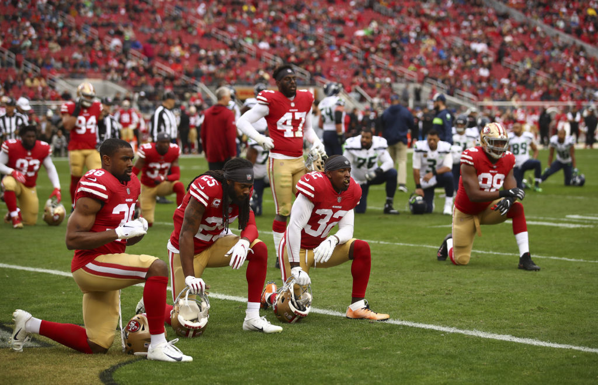

# A Bayesian Analysis on NFL Injuries: 

## Background
The NFL is valued as a $163B organization where athletes compete for a total of 20-24 games during the season (3 preseason, 17 in-season, 0-4 post-season games). A major complaint of fans over the last couple of years has surrounded the significance of injuries on the sport in several ways:

* Athlete Well-Being:
  * The physical and mental health of human beings is important.
  * Injuries impact an athlete's ability to live during and after their careers.
  * New research is demonstrating the tragic significance of once unforseen traumas, like concussions.
  
* Organizational Cost:
  * When star players that fandoms are build around are injured, this devaules the product that the NFL sells.
  * Organizations want players to be hurt to maintain fan interest and to not shell out "guaranteed" money for player contracts when those players aren't participating.
  
With that being said, the NFL has instated over 50 rule changes to reduce player danger since 2002 alone.

## What Are We Looking At?
Many of these rule changes have caused significant controversy over the last handful of seasons (just check Twitter). With this divide, many fans believe that the league is taking the fun out of the game by limiting exciting plays through the elimination of violence and contact. Using prior information from the 2009-2013 seasons, we inform multiple models (beta congjugate, dirichlet conjugate, and another beta conjugate model) to gain insight on **whether protocols set by the NFL to reduce player injury are successful or not over the last 10 years**.

## Findings

Utilizing a Beta Conjugate Posterior model, the most massive of the posterior distribution shifts comes in 2016, where previously the distributions greatly reflected the prior. With this large shift, it is hard to tell if one rule specifically caused the change (clipping/kickoff format), both rules together did, or with the new rules, there was a crackdown on officiating. This change could also have been caused by unforseen factors, like age.

Amid speculation that age is an unforseen factor (perhaps there is a greater proportion of older, more injury prone players present in the league), we utilize a Dirichlet Conjugate Posterior Distribution for four different age bins to gain insight on what distributions of ages occupy the NFL. It is discovered that the percent makeup of 30+ year olds in the league remains around a constant theta distribution; however, the number of 20-24 year olds and 35+ year olds seams to shift and then realign with the start of the decade.

Because of the slight change in 20-24 year old distribution, we decide to check on the percentage of players that get hurt compared to all players present that are that age. The results are pretty alarming and display that athletes from 20-24 years old have a much more likely chance of becoming injured. Whether this is due load management, increased volume compared to older players, the verocity of a new, intense league, newer sports science training that has progressed explosive movement too fast, or other reasons, it is unclear.

From our three posterior distribution functions and many other exploratory data wranglings and visualizations, we are able to demonstrate that there has been a definite shift in the injury rate in the NFL in the last 10 years for the better. While it seems like injuries to younger players have gotten worse and the influx of younger athletes has swung, the injury likelihood for older athletes has significantly dropped. This demonstrates that age is a factor for players getting injured, but doesn't quite explain the dropoff of injury rate within the league. Other factors should be explored to fully assert the claim that NFL rules are indeed reducing injury likelihood amongst athletes. Meanwhile, the findings from this analysis have demonstrates a need for better rehabiliation, therapy, and training methods for younger athletes entering the NFL.

## Run It For Yourself!
1. Install Necessary Packages (found in the top of the [Notebook](https://github.com/brandonowens24/NFL-Injuries-Bayesian-Analysis/blob/main/NFL_injuries_bayesian_analysis.Rmd)).
2. Execute that Notebook! 

## Files and Folders
* [images](https://github.com/brandonowens24/NFL-Injuries-Bayesian-Analysis/tree/main/images) Contains relevant images for readme and notebook explanations.
* [Notebook](https://github.com/brandonowens24/NFL-Injuries-Bayesian-Analysis/blob/main/NFL_injuries_bayesian_analysis.Rmd) Contains full analysis and breakdown of the problem with executable code!
* [Notebook html](https://github.com/brandonowens24/NFL-Injuries-Bayesian-Analysis/blob/main/NFL_injury_bayesian_analysis.html) Contains raw html file.

## About
Author: Brandon Owens   
Date: 4/10/2024

