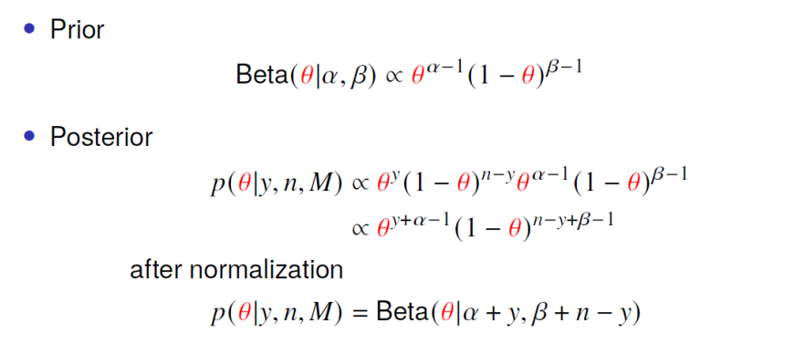

```{r setup, include=FALSE}
knitr::opts_chunk$set(echo = TRUE)
```

## Background
The NFL is valued as a $163B organization where athletes compete for a total of 21-24 games during the season (3 preseason, 17 in-season, 1-4 post-season games). A major complaint of fans over the last couple of years has surrounded the significance of injuries on the sport in several ways:

* Athlete Well-Being:
  * The physical and mental health of human beings is important.
  * Injuries impact an athlete's ability to live during and after their careers.
  * New research is demonstrating the tragic significance of once unforseen traumas, like concussions.
  
* Organizational Cost:
  * When star players that fandoms are build around are injured, this devaules the product that the NFL sells.
  * Organizations want players to be hurt to maintain fan interest and to not shell out "guaranteed" money for player contracts when those players aren't participating.
  
With that being said, the NFL has instated over 50 rule changes to reduce player danger since 2002 alone.


## What Are We Looking At?
Have these significant rule changes that have caused controversy really impacted the athlete's for the better? Many fans believe that the league is taking the fun out of the game by limiting exciting plays through hits, collissions, and game-officiating. Thus, are the rule changes actually helping to reduce injuries amongst athletes? That's what we are interested in.

Drawing on information from 2009-2013, we use this prior knowledge to inform a binomial likelihood of the number of players that get hurt in a season compared to all players in the National Football League. This allows us to form beta posterior distributions of what we can confidently predict the percentage of players we'd have expected to have gotten hurt from the 2014-2023 seasons. We are interested in analyzing **if protocols set by the NFL to reduce player injury are successful or not over the last 10 years**.


## Install Necessary Packages
```{r Load_Libraries}
library(dplyr)
library(nflfastR)
library(LearnBayes)
library(extraDistr)
library(coda)
library(bayesrules)
library(ggridges)
library(ggplot2)
library(tidyr)
```

## Read In Data
### Retrieve Players of Interest
```{r load_pbp}
injury <- nflreadr::load_injuries(2009:2023)
injury <- injury[!duplicated(injury[c("full_name", "season")]),]

players <- nflreadr::load_rosters_weekly(2009:2023)
players <- players %>% filter(status %in% c("ACT", "RSN", "DEV", "PUP", "INA"))
players <- players[!duplicated(players[c("full_name", "season")]), ]
```

Here, we will be using [nflreadr](https://nflreadr.nflverse.com/), which is an absolutely phenominal package for NFL data. You can kind of data from the NFL-verse that you can think of using this package. Specifically, we are interested in two different areas:

* injuries
* players in the league

For this Bayesian Analysis, we are interested in gauging the percentage of players in the NFL that get injured year over year. We are only interested on whether or not a player gets hurt (not the amount of times they get hurt in a year) and whether or not they are actually a contributing member on a roster. Thus, players that are 

* retired
* suspended
* on personal leave
* etc

are not included -- as they have a much less likely chance of getting hurt if they aren't actually playing. 

### Form Dataframe with Desired Values
```{r per_szn}
player_counts <- numeric(length = 10) 
injury_counts <- numeric(length = 10)

for (i in 1:15) {
  year <- 2008 + i
  
  player_counts[i] <- players %>% filter(season == year) %>% nrow()
  injury_counts[i] <- injury %>% filter(season == year, report_status %in% c("Out", "Doubtful", "Questionable")) %>% nrow()
}

dfall <- data.frame(
  year = c(2009:2023),
  number_of_players = player_counts,
  distinct_injuries = injury_counts,
  prob_inj = injury_counts/player_counts
)


df <- dfall %>% filter(year %in% (2014:2023))
```
Since the NFL-verse only has data from 2009-present for the weekly rosters and injury databases, we are only going to draw from 2009. For the sake of satisfaction, we are going to focus on Posterior distributions for only the last 10 years and use the prior information of anything after that as a basis for how injuries are designated. This is a nice place to start as clipping and unnecessary roughness penalties were expanded for blockers in the first year of our posterior (2014). 

When it comes to what classifies as an injury, players on the depth chart that have maintained their roster spot that are listed as either:

* Out
* Doubtful
* Questionable are those that qualify.

Obviously many of these injuries will come from practice, where players are trying to be careful, but that is something we cannot account for. In other words, it is impossible to see if a player sustains an injury in practice or in the game unless every news source is tracked and maintained for player status. Thus, we assume that players sustaining injuries in practice is just a natural part of the game that will maintain some level of normal variation from season to season. 


```{r view_df}
df
```


## Model Choice:
### Hyperparameter Choice
```{r choosing_hyper_params}
plot_beta(125,245)
```
According to the [Bayes Rules!](https://www.bayesrulesbook.com/chapter-3) by Alicia Johnson, Mine Dogucu, and Miles Ott, the choice of hyperparameters for a beta prior should roughly model the mean and variance of our prior beliefs. Thus, we choose

* $alpha = 125$
* $beta = 245$

As our hyper parameters for our prior beta distribution.

### Posterior
```{r hier}
iter <- 10000
n = df$number_of_players
x <- array(NA, c(iter, 10))
theta <- array(NA, c(iter, 10))

alpha <- 125
beta <-245

x[1, ]=df$distinct_injuries
theta[1, ]=df$prob_inj

for(i in 2:iter)
{
  x[i, ] <- rbinom(10, size = n, prob = theta[i - 1])
  theta[i, ] = rbeta(10, alpha+(x[i]), beta+n-(x[i])) 
}

```

With a binomial likelihood and a beta prior, we find ourselves with a beta-conjugate posterior model.

Our model looks like this:



Where we could simply use an analytical format, but for added variance and attempting to learn more about simulation methods -- we opt for Gibbs Sampling!


### Convergence?
```{r convergence_test}
Gibbs1=as.mcmc(theta[,1])
Gibbs2=as.mcmc(theta[,2])
Gibbs3=as.mcmc(theta[,3])
Gibbs4=as.mcmc(theta[,4])
Gibbs5=as.mcmc(theta[,5])
Gibbs6=as.mcmc(theta[,6])
Gibbs7=as.mcmc(theta[,7])
Gibbs8=as.mcmc(theta[,8])
Gibbs9=as.mcmc(theta[,9])
Gibbs10=as.mcmc(theta[,10])


Gibbs=mcmc.list(Gibbs1, Gibbs2, Gibbs3, Gibbs4, Gibbs5, Gibbs6, Gibbs7, Gibbs8, Gibbs9, Gibbs10)

raftery.diag(Gibbs)

```

We choose to run the Raftery-Lewis diagnostic, which gives us a good sense of how to make our MCMC draws converge. From here, it is apparent that using the same Gibbs sampling method... we should implement

* ~20,000 iterations
* ~20 sample burn-in
* 10 sample thinning

### Sampling
```{r sampled}
iter <- 20000
n = df$number_of_players
x <- array(NA, c(iter, 10))
theta <- array(NA, c(iter, 10))

alpha <- 125
beta <- 245

x[1, ]=df$distinct_injuries
theta[1, ]=df$prob_inj

for(i in 2:iter)
{
  x[i, ] <- rbinom(10, size = n, prob = theta[i - 1])
  theta[i, ] = rbeta(10, alpha+(x[i]), beta+n-(x[i])) 
}

x <- as.data.frame(x)
theta <- as.data.frame(theta)

binded <- cbind(x, theta)

burn <- 20
b <- burn + 1
k=10
N = round((iter-b)/k)

burned_df <- binded[b:iter, ]
final <- burned_df[k*(1:N), ]

```


### Convergence Plots
```{r plot_conv}
plot(final[,11], type="l", main="2014")
plot(final[,12], type="l", main="2015")
plot(final[,13], type="l", main="2016")
plot(final[,14], type="l", main="2017")
plot(final[,15], type="l", main="2018")
plot(final[,16], type="l", main="2019")
plot(final[,17], type="l", main="2020")
plot(final[,18], type="l", main="2021")
plot(final[,19], type="l", main="2022")
plot(final[,20], type="l", main="2023")
```


From these plots of the theta draws from 2014-2023, we can see that our model appears to have converged well!

Now, it would be beneficial to reshape our dataframe of draws so that I can compare the posteriors in ggplot:

```{r formatting}
final <- select(final, c(11:20))
colnames(final) <- c(2014:2023)

beta_sims <- rbeta(1998, 125, 245)
lower_ci <- quantile(beta_sims, 0.025)
higher_ci <- quantile(beta_sims, 0.975)
middle_ci <- mean(beta_sims)

final$Index <-seq_len(nrow(final))
melted_df <- pivot_longer(final, cols = -Index, names_to = "year", values_to = "value")
melted_df <- subset(melted_df, select = -Index)

melted_df$year <- as.factor(melted_df$year)
melted_df$value <- as.numeric(melted_df$value)
```


## Plots and Discussion
```{r plots}
ggplot(melted_df, aes(x = value, y = year, group=year, fill=year)) +
  geom_rect(aes(xmin=lower_ci,xmax=higher_ci,ymin=0,ymax=Inf),fill="grey",alpha=.2) +
    geom_density_ridges() +
  geom_vline(xintercept=c(lower_ci, middle_ci, higher_ci),
           linetype="dashed", color = "black") +
    theme(
    axis.title = element_text(face = "bold"),
    axis.text = element_text(face = "bold"),
    plot.title = element_text(face = "bold"),
    legend.position = "none"
  ) +
  ggtitle("NFL Injuries: 2014 to 2023") +
  xlab("Theta (Pct. of Players Injured)") +
  ylab("Year") +
  scale_y_discrete(limits=rev) +
  scale_x_reverse() +
  annotate(
    geom = "label", x = middle_ci, y = 0.5,
    label = "Prior 95% CI", angle=90
  )

```

## Discussion

Some of the major rule changes that may explain the posteriors are as follows (from [NFL.com](https://www.nfl.com/playerhealthandsafety/equipment-and-innovation/rules-changes/nfl-health-and-safety-related-rules-changes-since-2002)):

* **2014:** 
  * Clipping and unnecessary roughness penalties expanded to prohibit blockers from rolling up the side of a defender's leg.
* **2015:**
  * "Peel back" blocks extended to offensive players.
  * Backs prohibited from chopping defensive players outside of tackle box.
  * No pushing teammates during kicking attempts.
  * Defenseless player protection expanded to receiver of a pass.
* **2016:**
  * Chop blocks prohibited.
  * Horse collar rule expanded.
  * Move touchback reception to 25 yard line.
* **2017:**
  * Prohibits "leaper" blocks on kicks.
  * Receivers running routes get defenseless player protections.
  * Prohibits crack-back blocks for players in motion.
* **2018:**
  *Lowering the head is officially a penalty to make a tackle.
* **2019:**
  * Expanded protection to defenseless players when initiating a block.
* **2020:**
  * Defenseless player protection expanded to returners.
  * Initial line blocking with the helmet removed.
* **2023:**
  * Fair catch goes to team's 25 yard line hoping for more instances of fair catches.
  * Expands Impermissible Use of the helmet calls.
  
The most massive of the posterior distribution shifts comes in 2016, where previously the distributions greatly reflected the prior. With this large shift, it is hard to tell if one rule specifically caused the change, both rules together did, or with the new rules, there was a crackdown on officiating. Regardless, the previous four seasons have completely remained outside of our Prior distributions 95% confidence interval, signifying changes for the better when it comes to new rules and officiating! Next season will see updates to the entire format of the kickoff play and the swivel hip-drop tackle -- two instances of the game highly scrutinized for being dangerous... but also causing controversy with how difficult it will now be to tackle quarterbacks and larger players from behind.


## Conclusion
While there is evidence to demonstrate that the inclusion of these rules is indeed helping to keep athletes safer and dismiss the claims of unruly fans who believe these tweaks are unwarranted, it is unclear if the rule changes are *fully* responsible for the decrease in injury rate. Tightening of officiating is thought to be another major cause although this type of metric is much more difficult to express. This should be explored further.

Additionally, while cleaning the data, I opted to use a binomial model due to ease. The problem with this method lies in one distinct area:
* Players are only classified as `injured_during_season` or `not_injured_during_season`.
  * If a player sustains more than one injury it is not shown.
  * Severity of injury is not distinguished. 
  * Players can become injured at any time: even at practices our outside incidences. Thus I didn't account for when and where the players developed their injuries. Therefore, it's assumed that the rule changes help deload stress to players outside of game instances.

  

